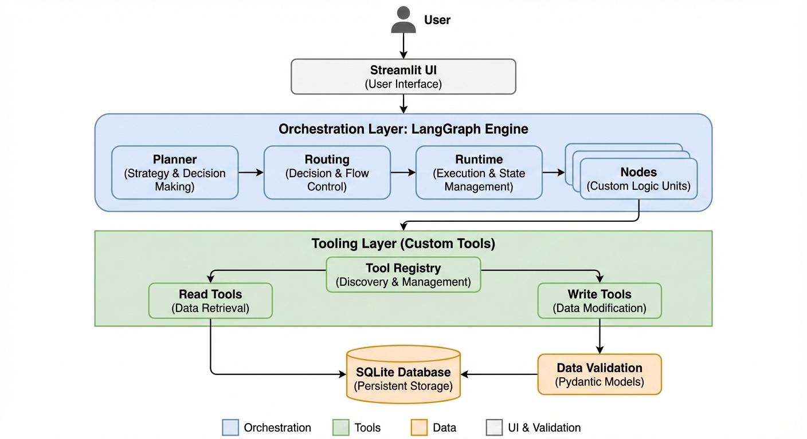

# Project Management Assistant with AI

A chat-based Project Management Assistant built with LangGraph. It can read project/task data, propose and execute write actions with human approval, run multi-step tool workflows, and expose a Streamlit UI with live data + regression evaluation.

## Features
- SQLite data layer with seeded PM data (`Projects`, `Tasks`, `TeamMembers`, `Comments`)
- Tool layer for read/write/workflow operations
- LangGraph orchestrator with:
  - LLM-based oracle planning
  - tool execution node
  - human approval safety gate for writes
  - persistent checkpoints via SQLite
- Streamlit UI with:
  - chat interface
  - real-time dashboard tables
  - approval controls
  - built-in regression test trigger
- Evaluation runner against golden samples

## Installation
### Prerequisites
- Python `3.12+`
- (Optional, recommended) virtual environment

### Setup (pip)
```bash
python -m venv .venv
# Windows PowerShell:
.venv\Scripts\Activate.ps1
# macOS/Linux:
# source .venv/bin/activate

pip install -U pip
pip install -e .
# Optional if missing in your environment:
pip install toml
```

### Setup (Poetry)
```bash
poetry install
poetry shell
```

## Usage
### 1. Run Streamlit app
```bash
streamlit run src/app.py
```

### 2. Run evaluation runner (CLI)
```bash
python -m src.evals.runner
```

### 3. Run tests
```bash
python -m pytest -q
```

## Configuration
Configuration is loaded from TOML files in `conf/` via `src.conf.Config`.

### Environment variables
- `OPENAI_API_KEY`
  - Required for LLM oracle planning when using OpenAI.

### Key config files
- `conf/orchestrator.toml`
  - `orchestrator.recursion_limit`
  - `orchestrator.checkpoint_path`
  - `orchestrator.prompt_dir`
  - `orchestrator.prompt_version`
  - `orchestrator.llm.*` (`api`, `base`, `model`, `temperature`, `api_key_env`)
- `conf/streamlit.toml`
  - UI settings (title, icon, layout)
- `conf/general.toml`
  - logging settings

### Prompt files
- `prompt/oracle_v1.txt`
- `prompt/oracle_v2.txt`

Prompt version is selected by `orchestrator.prompt_version`.

## Data Flow Explanation (high level)
<p align="center">
  
</p>

1. User sends a message from Streamlit (`src/ui/st_app.py`).
2. Message is sent to LangGraph runtime (`src/orchestrator/runtime.py`) with a persistent `thread_id`.
3. `oracle_node` (`src/orchestrator/nodes.py`) decides next step:
   - read tool call
   - write tool proposal (approval required)
   - direct response (no tool)
4. `execute_tool_node` runs tool functions from the registry (`src/tools/tools_registry.py`), implemented in:
   - `src/tools/read_tools.py`
   - `src/tools/write_tools.py`
5. For write actions, `human_approval_node` waits for Yes/No and only then executes.
6. State/messages are checkpointed through `SqliteSaver` so conversations survive restarts.
7. Streamlit refreshes and displays:
   - updated chat
   - updated sidebar dashboard tables from SQLite
   - technical logs for observability

## Project Structure
```text
src/                Main application source.
  app.py            Streamlit entrypoint
  db/               SQLite setup, schema bootstrapping, and seed data logic.
  tools/            Tool implementations and registry used by the orchestrator.
  orchestrator/     LangGraph state, planning, nodes, routing, and runtime wiring.
  ui/               Streamlit UI (chat, approval controls, dashboard, logs).
  evals/            Golden dataset + evaluation runner for regression checks.
conf/               TOML configuration files for logging, orchestrator, and Streamlit behaviour.
prompt/             Versioned oracle prompt templates used by the LLM planner.
tests/              Unit and regression tests for tools, orchestrator behavior, and evals.
```
